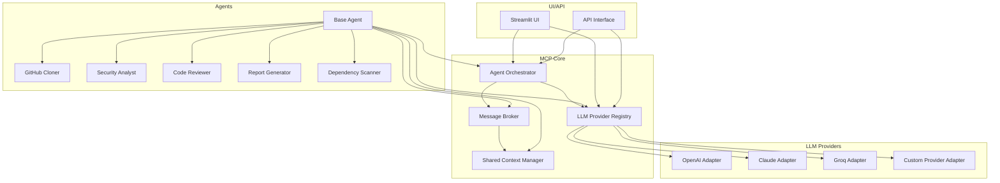

# CodiSkout: AI-Powered Code & Security Auditing

CodiSkout is an AI-powered code and security auditing system that uses a multi-agent architecture based on the Model Context Protocol (MCP). The system analyzes GitHub repositories for security vulnerabilities, code quality issues, and provides comprehensive reports.

## Architecture Overview

CodiSkout uses a modular MCP-based architecture that allows for easy extension and customization:



### Key Components

1. **MCP Core**: The foundation of the architecture, providing infrastructure for agent communication, shared context, and LLM provider management.
   - Message Broker: Handles communication between agents
   - Shared Context Manager: Provides a shared knowledge base
   - LLM Provider Registry: Manages different LLM providers

2. **LLM Providers**: Adapters for different language model services.
   - OpenAI Provider: For GPT models
   - Anthropic Provider: For Claude models
   - Groq Provider: For high-performance inference

3. **Agents**: Specialized components that perform specific tasks.
   - GitHub Cloner Agent: Clones repositories and analyzes structure
   - Security Analyst Agent: Analyzes code for security vulnerabilities
   - Code Reviewer Agent: Reviews code quality
   - Report Generator Agent: Generates comprehensive reports

4. **UI/API**: Interfaces for users to interact with the system.
   - Streamlit UI: Web-based user interface
   - API Interface: For programmatic access

## Installation

1. Clone the repository:
   ```bash
   git clone https://github.com/your-org/codi-skout.git
   cd codi-skout
   ```

2. Install dependencies:
   ```bash
   pip install -r requirements.txt
   ```

3. Set up environment variables for API keys:
   ```bash
   export OPENAI_API_KEY=your_openai_api_key
   export ANTHROPIC_API_KEY=your_anthropic_api_key
   export GROQ_API_KEY=your_groq_api_key
   ```

## Usage

### Running the UI

Start the Streamlit UI:

```bash
python -m codi_skout.app
```

The UI will be available at http://localhost:8501

### Using the API

The API provides endpoints for analyzing repositories and managing LLM providers:

```python
import requests

# Analyze a repository
response = requests.post(
    "http://localhost:8000/api/analyze",
    json={
        "repo_url": "https://github.com/username/repository",
        "provider": {
            "name": "groq",
            "model": "llama-3.1-8b-instant",
            "api_key": "your_provider_api_key"
        },
        "options": {
            "deep_analysis": True,
            "include_deps": True,
            "parallel_execution": True
        }
    }
)

task_id = response.json()["task_id"]

# Get analysis results
results = requests.get(f"http://localhost:8000/api/analysis/{task_id}/results")
```

## Extending the System

### Adding a New LLM Provider

1. Create a new file in the `llm/` directory, e.g., `llm/new_provider.py`
2. Implement the `LLMProvider` interface
3. Register the provider in `provider_factory.py`

Example:

```python
from typing import Dict, Any, List, Optional
import logging

from .base_provider import LLMProvider

class NewProvider(LLMProvider):
    """Provider for New LLM API"""
    
    provider_name = "new_provider"
    
    def __init__(self, api_key: str, **kwargs):
        super().__init__(**kwargs)
        self.api_key = api_key
        self.default_model = kwargs.get("default_model", "default-model")
    
    def generate_text(self, prompt: str, **kwargs) -> str:
        """Generate text from a prompt"""
        # Implement text generation using the provider's API
        # ...
        return generated_text
    
    def generate_chat_response(self, messages: List[Dict[str, str]], **kwargs) -> str:
        """Generate a response from a chat history"""
        # Implement chat completion using the provider's API
        # ...
        return response
    
    @property
    def available_models(self) -> List[str]:
        """Get the list of available models"""
        return [
            "model-1",
            "model-2"
        ]
```

### Adding a New Agent

1. Create a new file in the `agents/` directory, e.g., `agents/new_agent.py`
2. Implement the `BaseAgent` interface
3. Register the agent in `agent_factory.py`

Example:

```python
from typing import Dict, Any
import logging

from .base_agent import BaseAgent
from core.mcp_client import MCPClient

class NewAgent(BaseAgent):
    """A new agent for specific functionality"""
    
    def __init__(self, mcp_client: MCPClient):
        super().__init__("NewAgent", mcp_client)
        
        # Watch for repository context changes
        self.watch_context("repo")
    
    def process_task(self, task_data: Dict[str, Any]) -> Dict[str, Any]:
        """Process the main task for this agent"""
        try:
            # Update status in shared context
            self.set_context("repo/analysis_status/new_agent", "in_progress")
            
            # Implement agent-specific functionality
            # ...
            
            # Update status in shared context
            self.set_context("repo/analysis_status/new_agent", "completed")
            
            return {
                'success': True,
                'agent': self.name,
                'result': result,
                'message': "Task completed successfully"
            }
            
        except Exception as e:
            # Update status in shared context
            self.set_context("repo/analysis_status/new_agent", "failed")
            
            self.logger.error(f"Error in task processing: {str(e)}")
            return {
                'success': False,
                'agent': self.name,
                'error': str(e),
                'message': f"Task failed: {str(e)}"
            }
```

## Running Tests

Run all tests:

```bash
python -m codi_skout.tests.run_tests
```

Run specific test modules:

```bash
python -m codi_skout.tests.run_tests test_core_components test_agents
```

## License

[MIT License](LICENSE)